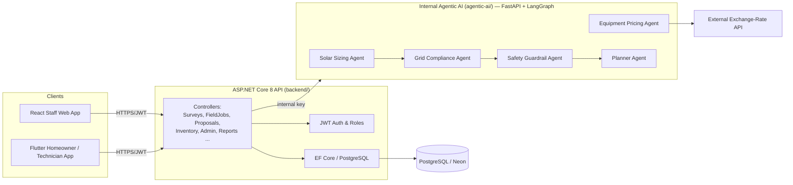

# ☀️ Smart Solar Installation & Grid Compliance Platform

**SE3090 – Software Engineering Frameworks | Group 2026-AI-17**

A full-stack, multi-client platform for Sri Lankan rooftop-solar planning — spanning customer surveys, field inspection, engineering approval and equipment procurement, backed by an internal multi-agent (LangGraph) planning service.

[](.github/workflows/backend-ci.yml)
[](.github/workflows/web-ci.yml)
[](.github/workflows/mobile-ci.yml)
[](.github/workflows/ai-ci.yml)
[](#license)

---

## Table of Contents

1. [Overview](#overview)
2. [What This Product Does — and Doesn't Do](#what-this-product-does--and-doesnt-do)
3. [System Architecture](#system-architecture)
4. [Repository Structure](#repository-structure)
5. [Tech Stack](#tech-stack)
6. [Prerequisites](#prerequisites)
7. [Getting Started (Local Setup)](#getting-started-local-setup)
8. [Running with Docker](#running-with-docker)
9. [Demo Accounts](#demo-accounts)
10. [Demonstration Walkthrough](#demonstration-walkthrough)
11. [Core Domains & Workflows](#core-domains--workflows)
12. [Agentic AI Services](#agentic-ai-services)
13. [API Reference](#api-reference)
14. [Testing & Evidence](#testing--evidence)
15. [Documentation Index](#documentation-index)
16. [Environment Variables](#environment-variables)
17. [Security Notes](#security-notes)
18. [Contributing](#contributing)
19. [Team](#team)
20. [License](#license)

---

## Overview

The **Smart Solar Installation & Grid Compliance Platform** is a working demonstration of how a homeowner's rooftop-solar interest becomes an approved, priced equipment package — covering the full lifecycle:

```
Homeowner survey → Field inspection → Engineering review → Proposal approval → Equipment pricing & reservation
```

The system is built as **four cooperating services**:

| Component | Role |
|---|---|
| **`backend/`** (ASP.NET Core 8) | Single client-facing gateway. Owns auth (JWT + roles), persistence (EF Core + PostgreSQL), and orchestrates calls to the internal AI service. |
| **`agentic-ai/`** (FastAPI + LangGraph) | Internal-only specialist service performing solar sizing, grid-compliance screening, safety checks and equipment pricing using deterministic rule-based agents (not a hosted LLM). |
| **`frontend-web/`** (React + TypeScript + Vite) | Staff console — survey review, job assignment, proposal approval, inventory & pricing management. |
| **`frontend-mobile/`** (Flutter) | Homeowner and field-technician mobile/web app — registration, surveys, site inspection, proposals, equipment status. |

---

## What This Product Does — and Doesn't Do

**Does:**
- Email-OTP-verified registration and account security (password change / account deletion) for web and mobile, with session revocation.
- Homeowner-submitted solar surveys with photo evidence and automated preliminary sizing.
- Field technician inspection workflow (location, camera/gallery capture, measured readings).
- Engineer review with approve / reject / request-revision, blocked by missing compliance evidence, with full audit history.
- Inventory management, LKR equipment pricing via a real exchange-rate API, and stock reservation.

**Does not:**
- Commission physical installations or submit/obtain utility (grid) connection approval.
- Certify anti-islanding protection or perform statutory engineering sign-off.
- Use a hosted/paid LLM — all "agentic" reasoning is deterministic rule-based logic running in LangGraph.

See **[docs/sri-lanka-scope.md](docs/sri-lanka-scope.md)** for the full set of assumptions (sizing formulas, voltage/frequency screening bands, panel wattage assumptions, and what still needs professional verification).

---

## System Architecture



Key architectural rules (see [docs/architecture/system-architecture.md](docs/architecture/system-architecture.md) and the [ADRs](docs/adr/)):

- **The ASP.NET Core API is the only client-facing gateway.** Web and mobile clients never talk to the agentic AI service directly.
- The agentic AI service is reachable only internally (`AGENTIC_AI_BASE_URL` + `AGENTIC_AI_INTERNAL_KEY`).
- All persistence and transactional integrity (e.g. inventory reservation) lives in PostgreSQL via EF Core — the AI service is stateless and deterministic.

---

## Repository Structure

```
Smart-Solar-Installation-Grid-Compliance-Platform/
├── backend/                     # ASP.NET Core 8 API + xUnit test suite
│   ├── SolarPlatform.Api/       # Controllers, Models, Services, Migrations, Middleware
│   └── SolarPlatform.Tests/     # 83+ backend tests (incl. PostgreSQL integration)
├── agentic-ai/                  # FastAPI + LangGraph internal specialist service
│   ├── app/agents/              # solar_sizing, grid_compliance, safety_guardrail, pricing, planner
│   ├── app/workflow/            # LangGraph graph + compliance/pricing/proposal workflows
│   ├── app/tools/               # exchange_rate.py, project_knowledge.py
│   └── tests/                   # pytest suite
├── frontend-web/                # React + TypeScript + Vite staff console
│   └── src/{pages,components,context,hooks,services,types}/
├── frontend-mobile/              # Flutter homeowner/technician app (Android, Windows, Web)
│   └── lib/{screens,widgets,models,providers,services,theme,utils}/
├── database/                    # SQL schema reference
│   └── schema/initial_schema.sql
├── docs/                        # Architecture, API, ADRs, testing, deployment, assessment docs
├── scripts/                     # smoke_workflow.py, build-lecture-report.py
├── prompts/                     # AI-assistance prompt history (disclosure)
├── docker-compose.yml           # backend + agentic-ai containers
├── neon.ts                      # Neon/PostgreSQL connection helper
├── .env.example                 # Root environment template
└── README.md                    # You are here
```

---

## Tech Stack

| Layer | Technology |
|---|---|
| Client Gateway API | ASP.NET Core 8, C#, Entity Framework Core |
| Database | PostgreSQL (Neon-compatible) |
| Auth | JWT bearer tokens, role-based authorization, email OTP |
| Internal AI Service | Python 3.11+, FastAPI, LangGraph, LangChain Core, httpx |
| Staff Web App | React 18, TypeScript, Vite 7, React Router 7, Vitest |
| Mobile / Homeowner-Technician App | Flutter (Dart), Provider, flutter_secure_storage, geolocator, image_picker |
| Containerization | Docker / docker-compose |
| CI | GitHub Actions (`backend-ci`, `web-ci`, `mobile-ci`, `ai-ci`) |

---

## Prerequisites

- [.NET 8 SDK](https://dotnet.microsoft.com/download)
- [Node.js 22+](https://nodejs.org/)
- [Python 3.11+](https://www.python.org/)
- [Flutter (stable channel)](https://docs.flutter.dev/get-started/install) + Android SDK/JDK for mobile builds
- A PostgreSQL database (local or [Neon](https://neon.tech))
- Git

---

## Getting Started (Local Setup)

### 1. Clone and configure environment

```bash
git clone <repository-url>
cd Smart-Solar-Installation-Grid-Compliance-Platform
cp .env.example .env
```

Set in `.env` (**never commit this file or paste real values into source/commits**):

```
DATABASE_CONNECTION_STRING=...
JWT_KEY=...
JWT_ISSUER=...
JWT_AUDIENCE=...
AGENTIC_AI_BASE_URL=http://localhost:8000
AGENTIC_AI_INTERNAL_KEY=...
```

### 2. Install dependencies

```powershell
python -m venv .venv
.\.venv\Scripts\python.exe -m pip install -r agentic-ai/requirements.txt
dotnet restore backend/SolarPlatform.sln
```

### 3. Apply database migrations

With `DATABASE_CONNECTION_STRING` available in the process environment:

```powershell
dotnet ef database update --project backend/SolarPlatform.Api
```

> The dev API reads the root `.env` automatically at runtime, but the `dotnet ef` design-time command needs the variable set directly in its own process environment.

### 4. Start all three services (separate terminals)

```powershell
# Terminal 1 — internal AI service (repo root)
.\.venv\Scripts\python.exe -m uvicorn app.main:app --app-dir agentic-ai --host 127.0.0.1 --port 8000

# Terminal 2 — API (0.0.0.0 lets an emulator/phone connect)
dotnet run --project backend/SolarPlatform.Api --urls http://0.0.0.0:5116

# Terminal 3 — staff web app
cd frontend-web
npm ci
npm run dev
```

Then open:
- Web app: **http://localhost:5173**
- API Swagger docs: **http://localhost:5116/swagger**
- Health check: **http://localhost:5116/api/health**

### 5. Run the mobile app

```powershell
cd frontend-mobile
flutter pub get
flutter run --dart-define=API_BASE_URL=http://10.0.2.2:5116
# or build a debug APK:
flutter build apk --debug --dart-define=API_BASE_URL=http://10.0.2.2:5116
```

For a physical device, replace `10.0.2.2` with your PC's LAN-reachable address. Use an HTTPS URL for any hosted deployment. See [docs/deployment/RELEASE-HANDOVER.md](docs/deployment/RELEASE-HANDOVER.md) for Windows symlink notes and device verification tips.

---

## Running with Docker

`docker-compose.yml` builds and runs the **agentic-ai** and **backend** containers together:

```bash
docker compose up --build
```

Required env vars (`AGENTIC_AI_INTERNAL_KEY`, `DATABASE_CONNECTION_STRING`, `JWT_KEY`, `JWT_ISSUER`, `JWT_AUDIENCE`) must be present in your shell or an `.env` file next to `docker-compose.yml`. The frontend apps are run separately (`npm run dev` / `flutter run`) — they are not containerized in this compose file.

---

## Demo Accounts

All seeded accounts use the development password **`Password@123`**:

| Email | Role |
|---|---|
| `admin@smartsolar.local` | Administrator |
| `engineer@smartsolar.local` | Senior Engineer |
| `technician@smartsolar.local` | Field Technician |
| `homeowner@smartsolar.local` | Homeowner |
| `inventory@smartsolar.local` | Inventory Officer |

> ⚠️ These are **public demo credentials** — replace or disable them before any public deployment. New self-registrations always receive the `HOMEOWNER` role only.

---

## Demonstration Walkthrough

1. **Register** a homeowner in the Flutter app and submit a survey (e.g. 600 kWh/month, 80 m² is a useful synthetic example).
2. **Engineer** assigns a field job in the React app. **Technician** checks in, records observed readings, and submits the inspection.
3. **Homeowner** opens the survey's proposal screen and requests a proposal.
4. **Engineer** reviews and approves / rejects / requests revision. Missing compliance evidence blocks approval; a requested revision is retained in history and a corrected inspection can support a resubmitted proposal.
5. **Inventory officer** adds active 500 W panels and an adequately-rated inverter, selects an approved proposal, calculates LKR pricing, and reserves equipment.
6. **Homeowner** refreshes equipment status. Staff may release reserved stock; replaying a completed reservation will not duplicate it.

**Notes:** Equipment quotes expire after 1 hour and do not hold stock until reserved. Costs exclude installation and taxes. Preliminary sizing uses 400 W panels; the final catalog selection uses 500 W panels — this discrepancy is intentional and documented in [docs/sri-lanka-scope.md](docs/sri-lanka-scope.md).

---

## Core Domains & Workflows

| Domain | Backend Controller | Key Models |
|---|---|---|
| Auth & Account Security | `AuthController` | `User`, `Role`, `UserRole`, `EmailChallenge` |
| Customer Surveys | `SurveysController`, `CustomerController` | `SolarSurvey`, `SolarSurveyImage`, `CustomerProfile` |
| Field Inspection | `FieldJobsController`, `TechnicianController` | `FieldJob`, `SiteInspection`, `SitePhoto`, `SiteTelemetry` |
| Engineering Approval | `EngineerController`, `ProposalsController` | `EngineeringProposal`, `ComplianceAssessment`, `ApprovalAuditLog` |
| Inventory & Pricing | `InventoryController` | `Inventory` |
| Agentic Orchestration | `AgentWorkflowsController`, `WorkflowOverviewController` | `AgentWorkflow`, `AgentExecutionLog` |
| Admin / Ops | `AdminController`, `ReportsController`, `HealthController` | — |

Architecture write-ups for each flow live under [`docs/architecture/`](docs/architecture/):
customer-survey-flow, field-inspection-flow, approval-workflow, inventory-pricing-flow, and the overall data-flow / system-architecture documents.

---

## Agentic AI Services

Internal, rule-based (non-LLM) specialist agents built with **LangGraph**, exposed only to the backend API:

| Agent | Purpose | Docs |
|---|---|---|
| `solar_sizing_agent.py` | Preliminary system sizing from monthly kWh usage | [solar-sizing-agent.md](docs/agentic-ai/solar-sizing-agent.md) |
| `grid_compliance_agent.py` | Voltage/frequency/phase screening against grid-connection rules | [grid-compliance-agent.md](docs/agentic-ai/grid-compliance-agent.md) |
| `safety_guardrail_agent.py` | Safety threshold checks (e.g. capacity above 10 kW triggers extra review) | [safety-guardrail-agent.md](docs/agentic-ai/safety-guardrail-agent.md) |
| `equipment_pricing_agent.py` | LKR pricing using a live allow-listed exchange-rate API | [equipment-pricing-agent.md](docs/agentic-ai/equipment-pricing-agent.md) |
| `planner_agent.py` / `proposal_validator.py` / `compliance_validator.py` | Orchestration and validation across the above | [agent-architecture.md](docs/agentic-ai/agent-architecture.md) |

The full graph wiring lives in `agentic-ai/app/workflow/graph.py`, with dedicated sub-workflows for compliance, pricing, and proposals.

---

## API Reference

Full endpoint documentation: [docs/api/api-overview.md](docs/api/api-overview.md), plus domain-specific references:
[customer-survey-api.md](docs/api/customer-survey-api.md) · [technician-api.md](docs/api/technician-api.md) · [proposal-api.md](docs/api/proposal-api.md) · [inventory-api.md](docs/api/inventory-api.md).

Quick reference:

| Method | Endpoint | Description |
|---|---|---|
| `GET` | `/api/health` | Public health/dependency check (DB + Agentic AI) |
| `POST` | `/api/auth/register/request-otp` | Request email OTP for registration |
| `POST` | `/api/auth/register` | Verify OTP and create a `HOMEOWNER` account |
| `POST` | `/api/auth/login` | Authenticate, returns JWT bearer token |
| `GET` | `/api/auth/me` | Current user profile + roles |
| `POST` | `/api/auth/password/request-otp` / `/confirm` | OTP-protected password change |
| `POST` | `/api/auth/account-deletion/request-otp` / `/confirm` | OTP-protected account deletion |
| `POST` | `/api/agent-workflows/test` | Internal orchestration call into the AI service |
| `GET` | `/api/admin/test`, `/api/engineer/test`, ... | Role-restricted verification endpoints |

Interactive Swagger UI is available at `http://localhost:5116/swagger` once the API is running.

---

## Testing & Evidence

```powershell
# Backend (.NET) — 83+ tests including PostgreSQL integration
dotnet test backend/SolarPlatform.sln

# Agentic AI (Python) — 38+ tests
.\.venv\Scripts\python.exe -m pytest -q

# Web (React/TypeScript) — 16+ tests
cd frontend-web
npm test
npm run build

# Mobile (Flutter) — 14+ tests
cd frontend-mobile
flutter analyze
flutter test
flutter build apk --debug
```

Set `TEST_DATABASE_CONNECTION_STRING` to additionally run the isolated PostgreSQL migration/concurrency/rollback test — it operates in its own schema and does not touch project tables.

**End-to-end smoke test** (run only against a demo database):

```powershell
.\.venv\Scripts\python.exe scripts/smoke_workflow.py --output docs/testing/live-workflow-evidence.json
```

This produces labelled synthetic records and a JSON evidence file with real HTTP statuses, timings, workflow state and exchange-rate results (no tokens or passwords included). See [docs/testing/testing-strategy.md](docs/testing/testing-strategy.md) and the phase test plans under `docs/testing/`.

---

## Documentation Index

| Topic | Link |
|---|---|
| System architecture | [docs/architecture/system-architecture.md](docs/architecture/system-architecture.md) |
| Database design | [docs/database/database-design.md](docs/database/database-design.md) |
| Inventory transactions & design | [docs/database/inventory-design.md](docs/database/inventory-design.md) |
| Sri Lankan scope & assumptions | [docs/sri-lanka-scope.md](docs/sri-lanka-scope.md) |
| Email verification (Gmail SMTP) setup | [docs/EMAIL-VERIFICATION.md](docs/EMAIL-VERIFICATION.md) |
| Brevo email setup | [docs/BREVO-SETUP.md](docs/BREVO-SETUP.md) |
| Architecture Decision Records | [docs/adr/](docs/adr/) (ADR-001 to ADR-007) |
| AI-assistance disclosure | [docs/AI-USAGE.md](docs/AI-USAGE.md) |
| Deployment / release handover | [docs/deployment/RELEASE-HANDOVER.md](docs/deployment/RELEASE-HANDOVER.md) |
| Deployment plan | [docs/deployment/deployment-plan.md](docs/deployment/deployment-plan.md) |
| Assignment readiness checklist | [docs/assessment/assignment-readiness.md](docs/assessment/assignment-readiness.md) |
| Contributions breakdown | [CONTRIBUTIONS.md](CONTRIBUTIONS.md) |

> Earlier Phase 1–4 documents describe their respective implementation stages; this README and the release handover doc describe current, verified scope. Hosting/production deployment remains deferred for this academic submission.

---

## Environment Variables

| Variable | Used by | Description |
|---|---|---|
| `DATABASE_CONNECTION_STRING` | backend | PostgreSQL/Neon connection string |
| `JWT_KEY` / `JWT_ISSUER` / `JWT_AUDIENCE` | backend | JWT signing and validation config |
| `AGENTIC_AI_BASE_URL` | backend | Internal URL of the FastAPI service (e.g. `http://localhost:8000`) |
| `AGENTIC_AI_INTERNAL_KEY` | backend, agentic-ai | Shared secret authorizing backend → AI service calls |
| `TEST_DATABASE_CONNECTION_STRING` | backend tests | Optional isolated DB for PostgreSQL integration tests |
| `API_BASE_URL` (dart-define) | frontend-mobile | Base URL the mobile app targets |

See `.env.example`, `agentic-ai/.env.example`, and `frontend-web/.env.example` for the full templates. **Never commit populated `.env` files or paste real secrets into commits, issues, or transcripts.**

---

## Security Notes

- Development HTTP (`http://localhost:5116`) is intended for local demonstration only — use HTTPS for any hosted environment.
- Registration and sensitive account actions (password change, account deletion) require email OTP verification, with prior sessions revoked on password change.
- The web login has no demo-account shortcuts; demo credentials above are for manual testing only.
- The internal AI service is not reachable by clients directly — it is gated behind `AGENTIC_AI_INTERNAL_KEY` and only called by the backend.

---

## Contributing

See [CONTRIBUTIONS.md](CONTRIBUTIONS.md) for the team's business-area ownership breakdown, and the `.github/workflows/` CI pipelines (`backend-ci`, `web-ci`, `mobile-ci`, `ai-ci`) that run on each component.

---

## Team

**SE3090 – Software Engineering Frameworks, Group 2026-AI-17**
Four members collaborated across the API, database, both frontends, the agentic workflow, testing, integration, and documentation, each owning one primary business area:
1. Customer Assessment & Solar Sizing
2. Field Inspection
3. Engineering Approval & Compliance
4. Inventory & Equipment Pricing

Full names, individual contribution statements, and reflections are documented in [CONTRIBUTIONS.md](CONTRIBUTIONS.md).

---

## License

Academic project submitted for SE3090 (Software Engineering Frameworks). Not licensed for commercial use. Demo credentials, sample pricing data, and synthetic records in this repository are for coursework demonstration only.

