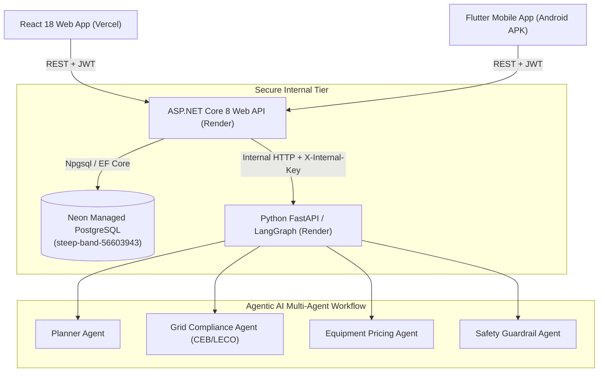

# Smart Solar Installation & Grid Compliance Platform

[](https://github.com/ThisulHerath/Smart-Solar-Installation-Grid-Compliance-Platform/actions/workflows/backend-ci.yml)
[](https://github.com/ThisulHerath/Smart-Solar-Installation-Grid-Compliance-Platform/actions/workflows/ai-ci.yml)
[](https://github.com/ThisulHerath/Smart-Solar-Installation-Grid-Compliance-Platform/actions/workflows/web-ci.yml)

## 1. Project Overview & Problem Statement
The **Smart Solar Installation & Grid Compliance Platform** is an enterprise-grade software platform developed for the **SE3090 Software Engineering Frameworks** course.

In Sri Lanka and emerging renewable energy markets, deploying residential and commercial rooftop solar requires intricate compliance checks with national utility standards (CEB / LECO), equipment compatibility sizing, field telemetry verification, and multi-tier engineering approvals. This platform streamlines and automates the end-to-end solar proposal, compliance checking, and installation lifecycle through a unified backend, responsive web portal, mobile field app, and multi-agent AI orchestration engine.

---

## 2. Mandatory Technology Stack

| Layer | Technology | Framework & Libraries |
| :--- | :--- | :--- |
| **Backend API** | C# / .NET 8.0 | ASP.NET Core Web API, BCrypt, JWT Bearer, Swagger |
| **ORM & Data** | Entity Framework Core 8.0 | Npgsql PostgreSQL Provider, EF Core Migrations |
| **Database** | Neon Managed PostgreSQL | Serverless PostgreSQL (`steep-band-56603943`) |
| **Agentic AI** | Python 3.11 / 3.14 | FastAPI, LangGraph, Pydantic, Uvicorn |
| **Web Portal** | TypeScript & React 18 | Vite, React Router v6, Context API, CSS Design Tokens |
| **Mobile App** | Dart / Flutter 3 | Provider, Flutter Secure Storage, HTTP |
| **CI / CD** | GitHub Actions | Automated build and test pipelines |

---

## 3. System Architecture



> [!IMPORTANT]
> **Architectural Boundary:** React and Flutter communicate **strictly and exclusively** with the ASP.NET Core Web API. They never connect directly to Neon PostgreSQL or the internal Python FastAPI service.

---

## 4. Repository Structure

```
├── .github/workflows/         # CI/CD Workflows (Backend, Web, AI)
├── agentic-ai/                # Python FastAPI & LangGraph multi-agent service
│   ├── app/
│   │   ├── agents/            # Planner, Grid, Pricing, Safety agents
│   │   ├── schemas/           # Pydantic models & state definitions
│   │   ├── workflow/          # LangGraph state machine graph
│   │   └── main.py            # FastAPI entrypoint
│   ├── tests/                 # AI unit tests
│   ├── requirements.txt
│   └── Dockerfile
├── backend/                   # ASP.NET Core 8 Web API & EF Core
│   ├── SolarPlatform.Api/     # REST Controllers, Auth, Models, Integrations
│   ├── SolarPlatform.Tests/   # xUnit Backend tests
│   └── SolarPlatform.sln
├── database/                  # Schema SQL migrations & seed documentation
│   ├── schema/                # initial_schema.sql
│   └── README.md
├── frontend-web/              # React + TypeScript + Vite web portal
│   ├── src/
│   │   ├── components/        # Layout, Navbar, ProtectedRoute, Icons
│   │   ├── context/           # AuthContext (React State Management)
│   │   ├── pages/             # Login, Dashboard, Unauthorized, NotFound
│   │   └── services/          # Central API Client
│   └── package.json
├── frontend-mobile/           # Flutter / Dart mobile client
│   ├── lib/                   # Models, services, providers, screens, widgets
│   ├── test/                  # Widget & unit tests
│   └── pubspec.yaml
├── docs/                      # Comprehensive Architecture & ADRs
│   ├── architecture/
│   ├── database/
│   ├── api/
│   ├── agentic-ai/
│   ├── testing/
│   ├── deployment/
│   └── adr/                   # ADR-001 through ADR-005
├── .env.example               # Safe environment variable placeholders
├── docker-compose.yml         # Container orchestration (AI & Backend API)
└── README.md
```

---

## 5. Neon Database Setup & Configuration

- **Neon Project ID**: `steep-band-56603943`
- **Branch**: `production`
- **Connection Format**:
  `Host=ep-steep-band-56603943.us-east-2.aws.neon.tech;Database=neondb;Username=neondb_owner;Password=YOUR_NEON_PASSWORD;SSL Mode=Require;Trust Server Certificate=true`

### Linking with Neon CLI (Optional)
```bash
npm i -g neon@latest
neon login
neon link --project-id steep-band-56603943 --branch production -y
neon config init
```

---

## 6. Environment Variables

Create `.env` based on `.env.example`:

```bash
# Database: Neon Managed PostgreSQL
DATABASE_CONNECTION_STRING=Host=ep-steep-band-56603943.us-east-2.aws.neon.tech;Database=neondb;Username=neondb_owner;Password=YOUR_PASSWORD;SSL Mode=Require;Trust Server Certificate=true

# JWT Authentication
JWT_KEY=SmartSolarSuperSecretKeyForDevelopmentAndJwtAuthentication2026!
JWT_ISSUER=SmartSolarPlatform
JWT_AUDIENCE=SmartSolarClients
JWT_EXPIRE_MINUTES=60

# Internal Agentic AI Service
AGENTIC_AI_BASE_URL=http://localhost:8000
AGENTIC_AI_INTERNAL_KEY=smart-solar-ai-internal-key-development

# Frontend Web
VITE_API_BASE_URL=http://localhost:5000
```

---

## 7. How to Run the Platform Locally

### 1. Start Python Agentic AI Service
```bash
cd agentic-ai
pip install -r requirements.txt
uvicorn app.main:app --host 0.0.0.0 --port 8000 --reload
```
*Health Check:* `GET http://localhost:8000/health`

### 2. Start ASP.NET Core Web API
```bash
cd backend/SolarPlatform.Api
dotnet run
```
- **Swagger UI**: [http://localhost:5000/swagger](http://localhost:5000/swagger)
- **Health Endpoint**: [http://localhost:5000/api/health](http://localhost:5000/api/health)

### 3. Start React Web Dashboard
```bash
cd frontend-web
npm install
npm run dev
```
*Web App URL:* [http://localhost:5173](http://localhost:5173)

### 4. Run Flutter Mobile App
```bash
cd frontend-mobile
flutter pub get
flutter run
```

---

## 8. Database Migrations

### Apply Migrations to Neon
```bash
cd backend/SolarPlatform.Api
dotnet ef database update
```

### Add New Migration
```bash
cd backend/SolarPlatform.Api
dotnet ef migrations add <MigrationName> --output-dir Migrations
```

---

## 9. Running Tests

### Run Backend Tests (xUnit)
```bash
dotnet test backend/SolarPlatform.sln
```

### Run Agentic AI Tests (Python)
```bash
python -m unittest discover -s agentic-ai/tests -p "test_*.py"
```

### Build Frontend Web (TypeScript / Vite)
```bash
cd frontend-web
npm run build
```

---

## 10. Development Test Accounts

| Role | Email | Password | Intended Capability |
| :--- | :--- | :--- | :--- |
| **ADMINISTRATOR** | `admin@smartsolar.local` | `Password@123` | System oversight & Admin endpoint access |
| **SENIOR_ENGINEER** | `engineer@smartsolar.local` | `Password@123` | Proposal approval & Engineer endpoint access |
| **FIELD_TECHNICIAN**| `technician@smartsolar.local` | `Password@123` | On-site mobile survey & telemetry capture |
| **HOMEOWNER** | `homeowner@smartsolar.local` | `Password@123` | Customer solar proposal inspection |
| **INVENTORY_OFFICER**| `inventory@smartsolar.local` | `Password@123` | Hardware catalogs & pricing management |

---

## 11. Phase 1 Scope & Limitations

> [!NOTE]
> Phase 1 intentionally establishes the **complete architectural foundation, security boundaries, multi-tier connectivity, and CI pipelines**. The following domain features are planned for subsequent phases:
> - Full roof polygon drawing & 3D solar irradiance calculations (Phase 2)
> - Live dynamic CEB/LECO grid utility tariff integration (Phase 2)
> - Real-time camera & GPS mobile field surveys (Phase 2)
> - Live currency exchange rates and quotation PDF generation (Phase 3)
