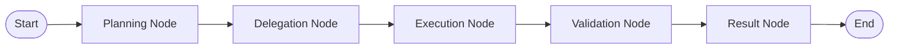

# Agentic AI Multi-Agent Architecture

## Overview
The Agentic AI service is built on **Python 3.11/3.14 + FastAPI + LangGraph + Pydantic**.

## Multi-Agent Responsibilities
1. **PlannerAgent**:
   - Decomposes high-level solar design objectives into multi-step execution plans.
2. **GridComplianceAgent**:
   - Verifies statutory utility guidelines (CEB / LECO net metering, export limits, anti-islanding).
3. **EquipmentPricingAgent**:
   - Calculates hardware bill of materials (panels, hybrid inverters, mounting kits) and pricing estimates.
4. **SafetyGuardrailAgent**:
   - Validates roof setbacks, structural wind loads, and electrical disconnect safety standards.

## LangGraph Workflow Graph

## Internal API Security
- **Header**: `X-Internal-Key`
- The service is isolated in private cloud networks and only callable by ASP.NET Core API.
