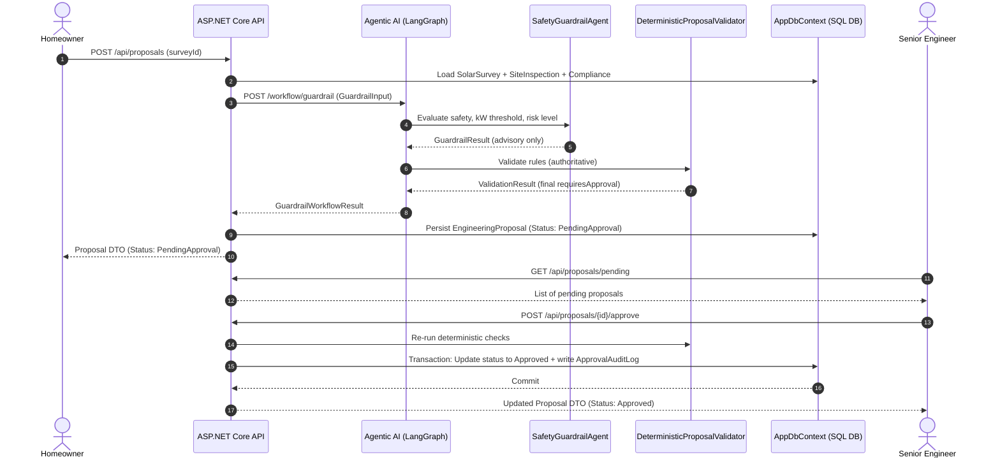

# Engineering Proposal Approval Workflow Architecture

## Overview
This document details the end-to-end multi-agent workflow governing Engineering Proposal creation, Safety Guardrail evaluation, Deterministic Validation, and Human Senior Engineer Approval.

---

## Architectural Sequence

---

## Governance Rules & Safety Principles

1. **No Automatic AI Approvals**: The AI agent (`SafetyGuardrailAgent`) **never** has the authority to approve a proposal. It produces advisory findings, risk assessments, and recommendations.
2. **Deterministic Overrides**: The `DeterministicProposalValidator` executes code-level rules outside the LLM context. If system capacity > 10kW or grid compliance is non-compliant, human approval is strictly mandatory regardless of AI output.
3. **Fail-Safe Default**: If the AI service is offline or throws an exception, the system defaults `requiresApproval = True` and `safetyStatus = REQUIRES_APPROVAL`.
4. **Audit Trail Immutability**: All approval, rejection, and revision decisions are recorded in `ApprovalAuditLogs` with user IDs, timestamps, and commentary.
