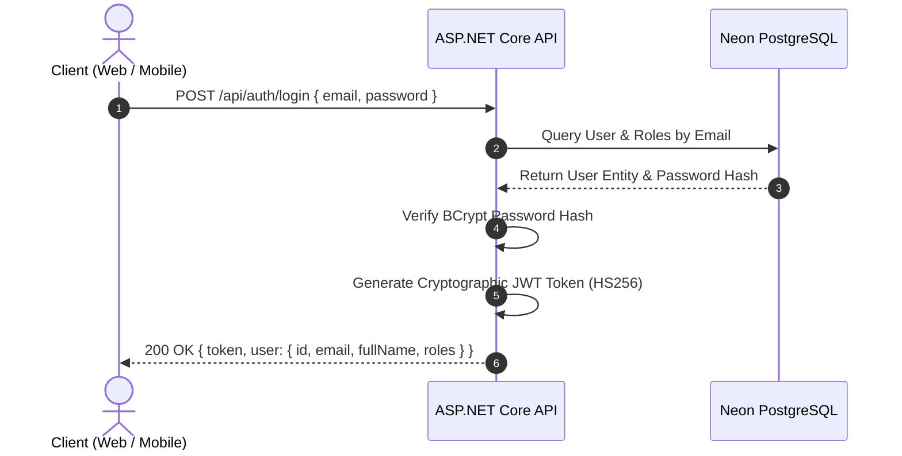
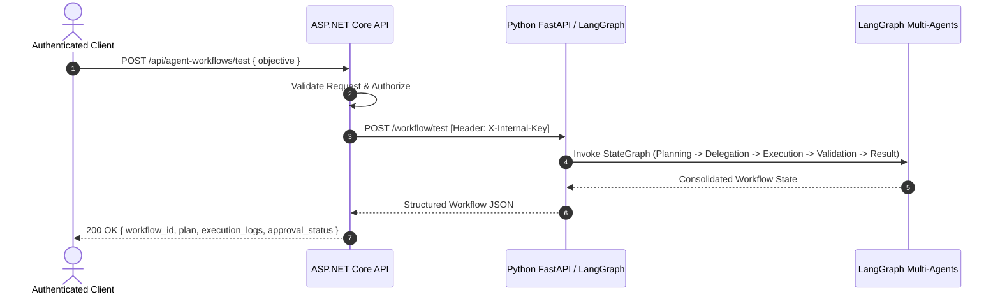
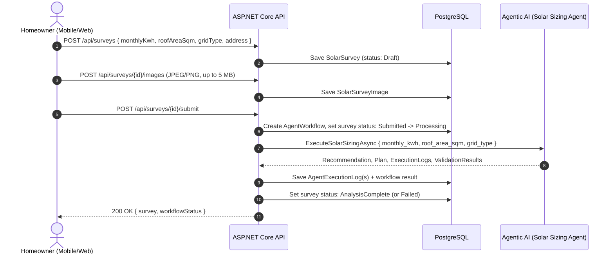
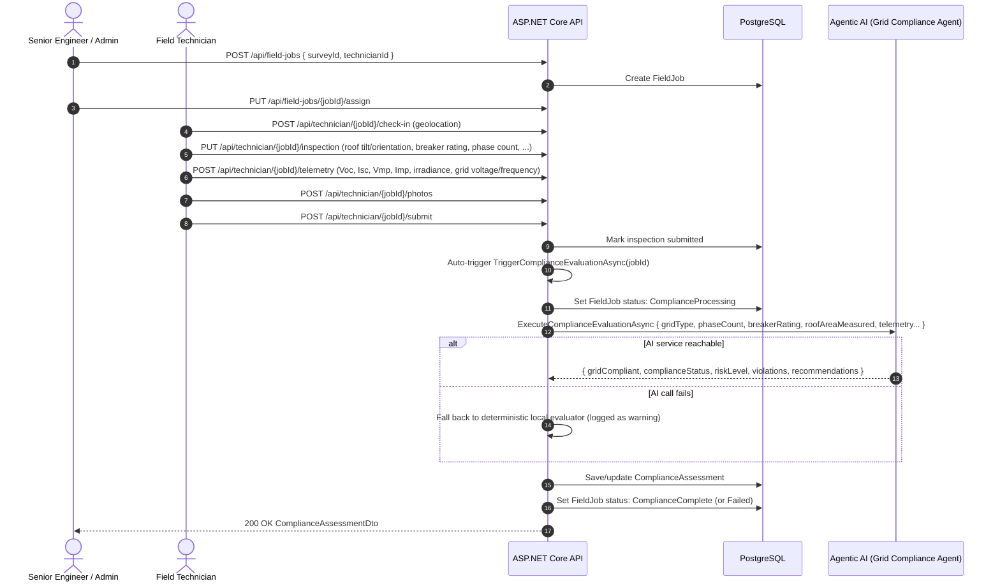
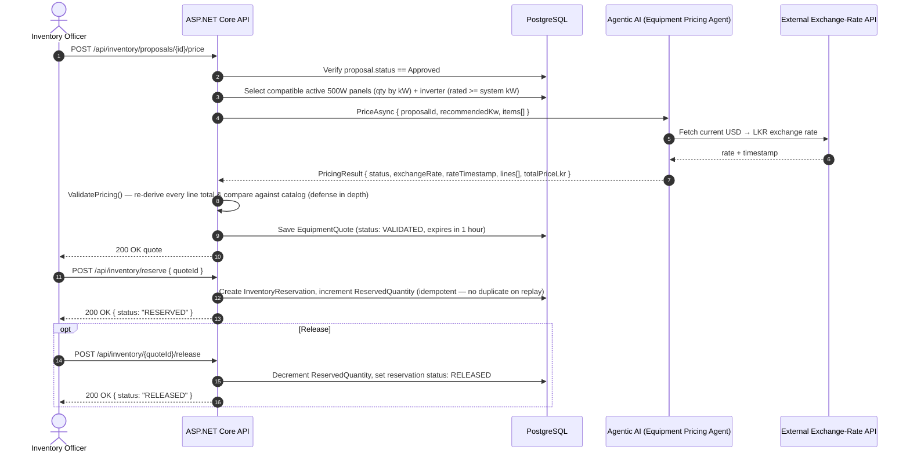

# Platform Data Flow

## 1. Authentication Flow

## 2. Agentic AI Workflow Flow

## 3. Survey Submission & Preliminary Sizing Flow

> Note: the survey's `roofAreaSqm` at this stage is homeowner-reported and used only for *preliminary* sizing. It is re-measured by a technician during field inspection (Flow 4) and that measured value takes precedence for compliance evaluation.

## 4. Field Inspection & Grid Compliance Flow

> An engineer can also re-trigger evaluation directly via `POST /api/field-jobs/{jobId}/evaluate-compliance`, independent of the technician's original submit call.

## 5. Equipment Pricing & Reservation Flow

> Quotes expire one hour after creation and reserve no stock until the explicit `/reserve` call — a quote alone does not hold inventory.
