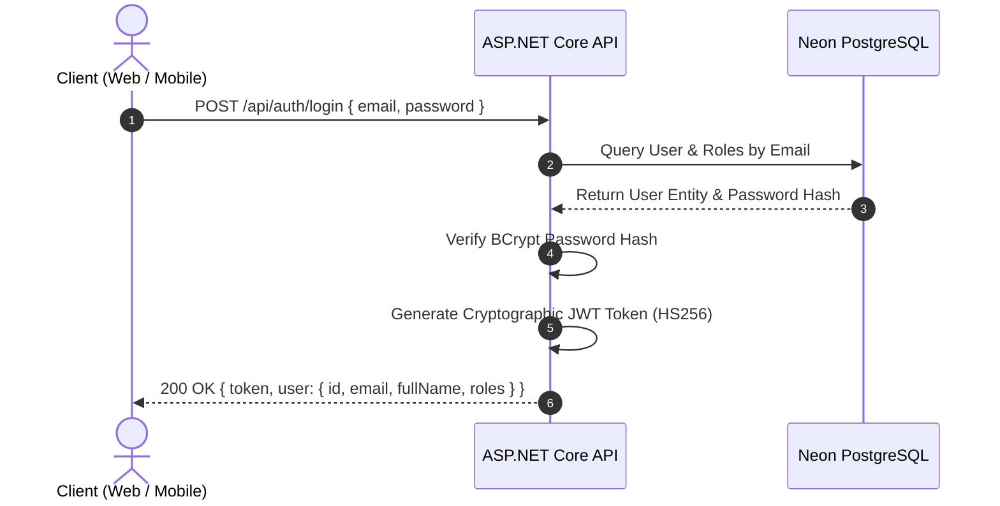
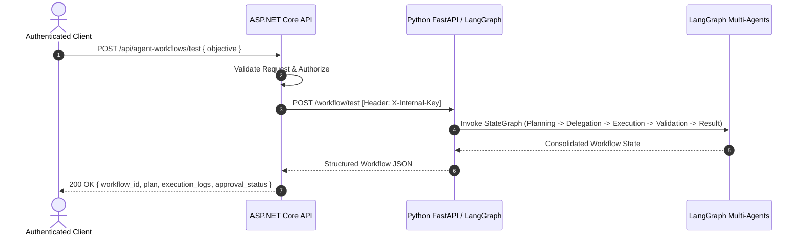

# Platform Data Flow

## 1. Authentication Flow

```mermaid
sequenceDiagram
    autonumber
    actor User as Client (Web / Mobile)
    participant API as ASP.NET Core API
    participant DB as Neon PostgreSQL

    User->>API: POST /api/auth/login { email, password }
    API->>DB: Query User & Roles by Email
    DB-->>API: Return User Entity & Password Hash
    API->>API: Verify BCrypt Password Hash
    API->>API: Generate Cryptographic JWT Token (HS256)
    API-->>User: 200 OK { token, user: { id, email, fullName, roles } }
```

## 2. Agentic AI Workflow Flow

```mermaid
sequenceDiagram
    autonumber
    actor Client as Authenticated Client
    participant API as ASP.NET Core API
    participant AI as Python FastAPI / LangGraph
    participant Agents as LangGraph Multi-Agents

    Client->>API: POST /api/agent-workflows/test { objective }
    API->>API: Validate Request & Authorize
    API->>AI: POST /workflow/test [Header: X-Internal-Key]
    AI->>Agents: Invoke StateGraph (Planning -> Delegation -> Execution -> Validation -> Result)
    Agents-->>AI: Consolidated Workflow State
    AI-->>API: Structured Workflow JSON
    API-->>Client: 200 OK { workflow_id, plan, execution_logs, approval_status }
```
