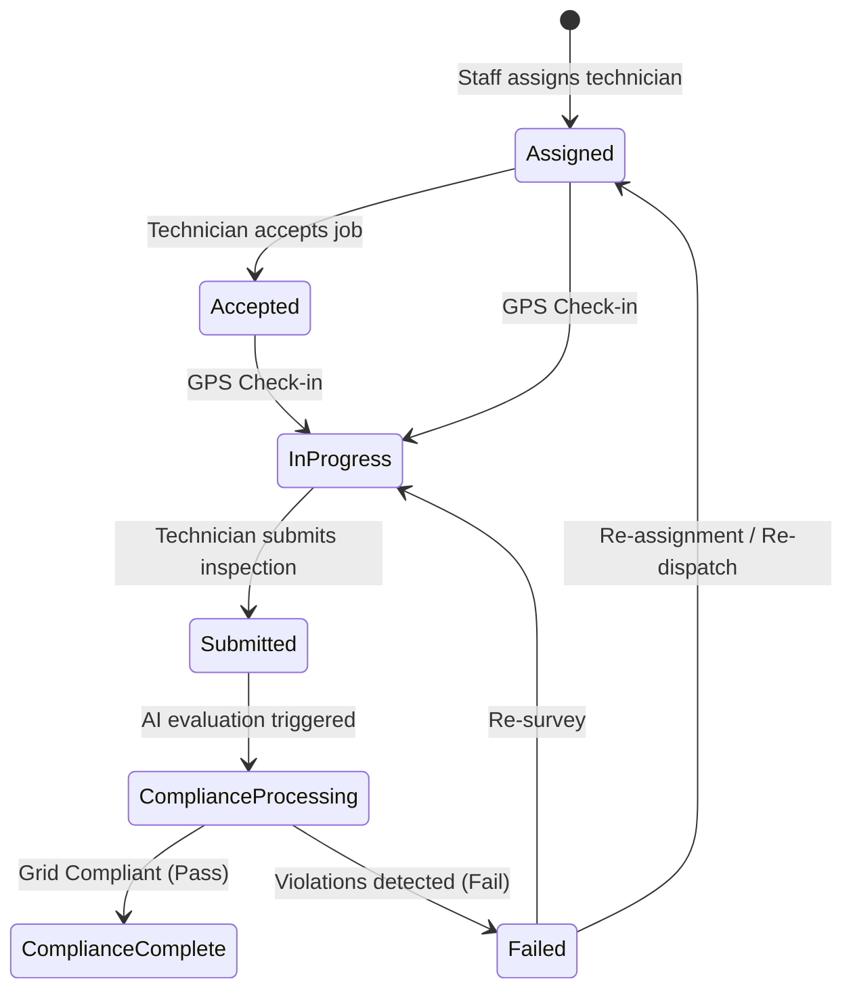

# Field Inspection Lifecycle & State Machine

## 1. Field Job Lifecycle State Machine

The field job processing lifecycle is governed by an explicit state transition matrix implemented in `FieldJobStatusTransition.cs`:

---

## 2. Transition Rules & Invariants

1. **State Immutability of Completed Jobs**: Once `ComplianceComplete` is reached, state is final unless re-evaluated by a Senior Engineer.
2. **Mandatory GPS Check-in**: Field technician cannot submit a site inspection without recorded GPS latitude and longitude coordinates.
3. **Deterministic Validation Gate**: The status cannot transition to `ComplianceComplete` if any statutory electrical thresholds (grid voltage, frequency, breaker rating) are breached.
4. **Audit Trail**: Every state transition updates `UpdatedAt` timestamps and emits structured logs in `ComplianceAssessment`.
