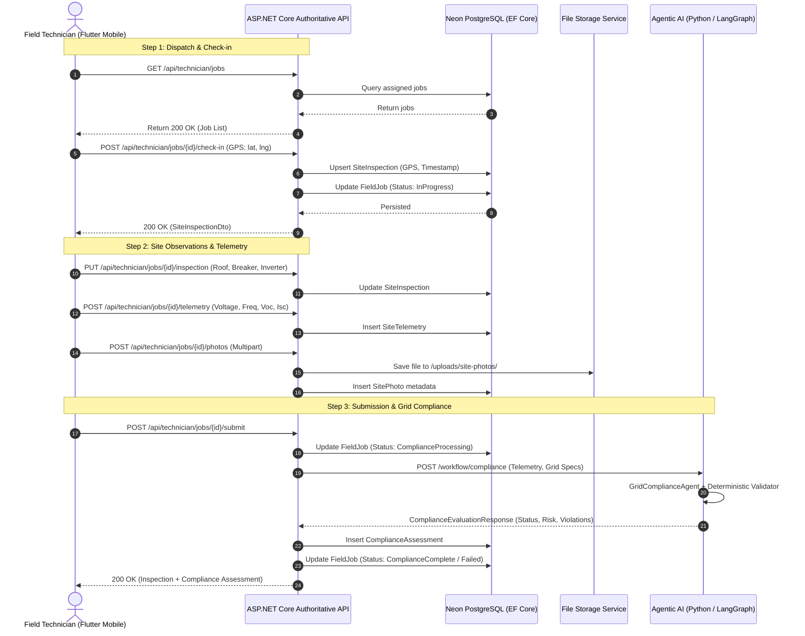

# Field Technician Site Operations & Architecture Design

## 1. Executive Summary

Phase 3 introduces the **Field Technician Site Operations & Grid Compliance** vertical slice. This subsystem enables solar installation companies to dispatch authorized field technicians to residential and commercial premises, record verified GPS check-in coordinates, capture structured roof and electrical system parameters, record precision digital multimeter telemetry (Voc, Isc, Vmp, Imp, Grid Voltage, Grid Frequency), upload evidentiary site photographs, and initiate automated grid compliance analysis.

---

## 2. Architecture & Component Interaction

---

## 3. Data Model Entities

### 3.1 `FieldJob`
Links an approved or submitted `SolarSurvey` to a designated `Technician` (`User`).
- `Id`: Primary Key (UUID)
- `SolarSurveyId`: Foreign Key to `SolarSurvey`
- `TechnicianId`: Foreign Key to `User` (Restricted to `RoleConstants.FieldTechnician`)
- `Status`: `FieldJobStatus` enum (`Assigned`, `Accepted`, `InProgress`, `Submitted`, `ComplianceProcessing`, `ComplianceComplete`, `Failed`)
- `Priority`: `FieldJobPriority` enum (`Low`, `Medium`, `High`, `Urgent`)
- `AssignedAt`, `ScheduledAt`, `CreatedAt`, `UpdatedAt`

### 3.2 `SiteInspection`
Contains on-site physical and safety observations:
- `CheckInLatitude`, `CheckInLongitude`, `CheckInAt`
- `RoofAreaMeasuredSqm`, `RoofOrientation`, `RoofTilt`
- `GridTypeObserved`, `PhaseCount`, `MainBreakerRating`
- `InverterLocationSuitable`
- `SafetyNotes`, `TechnicianNotes`
- `InspectionStatus` (`Draft`, `Submitted`, `Reviewed`)

### 3.3 `SiteTelemetry`
Time-stamped electrical and environmental measurements:
- `MeasurementType`: `Voc`, `Isc`, `Vmp`, `Imp`, `Irradiance`, `Temperature`, `GridVoltage`, `GridFrequency`
- `MeasurementValue`: Decimal (12, 4)
- `Unit`: String (V, A, W/m², °C, Hz)

### 3.4 `SitePhoto`
Evidentiary photographic documentation:
- `PhotoType`: `Roof`, `Meter`, `ElectricalPanel`, `InverterLocation`, `SafetyIssue`, `Other`
- `FileUrl`, `FileName`, `CreatedAt`

### 3.5 `ComplianceAssessment`
Formal evaluation output generated by the Agentic AI / deterministic compliance engine:
- `WorkflowId`: Unique LangGraph execution identifier
- `GridCompliant`: Boolean flag
- `ComplianceStatus`: `COMPLIANT`, `NON_COMPLIANT`, `CONDITIONAL`
- `RiskLevel`: `LOW`, `MEDIUM`, `HIGH`, `CRITICAL`
- `ValidationStatus`: `PASSED`, `FAILED_DETERMINISTIC_CHECK`
- `ComplianceNotes`: Aggregated violations and remedial recommendations
