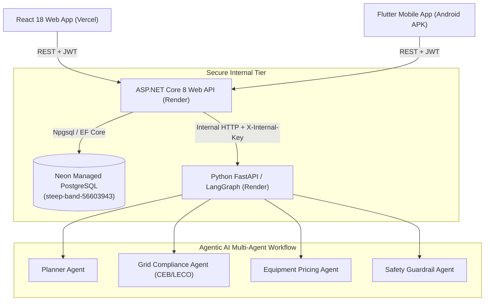

# System Architecture

## Architectural Overview
The **Smart Solar Installation & Grid Compliance Platform** is structured as a multi-tier, secure, distributed cloud system designed for solar installation planning, grid compliance verification, and field telemetry.

## Architectural Boundaries & Principles
1. **Authoritative Public Entrypoint**: ASP.NET Core is the **only** publicly accessible backend service.
2. **Direct Access Prohibition**: Neither React Web nor Flutter Mobile are permitted to communicate directly with Neon PostgreSQL or the Python FastAPI AI service.
3. **Role-Based Access Control**: Standard JWT tokens carry user identities and roles (`HOMEOWNER`, `FIELD_TECHNICIAN`, `SENIOR_ENGINEER`, `INVENTORY_OFFICER`, `ADMINISTRATOR`).
4. **Resilience & Graceful Degradation**: If downstream AI or database dependencies experience transient downtime, the health and workflow endpoints handle errors safely without platform crashes.
