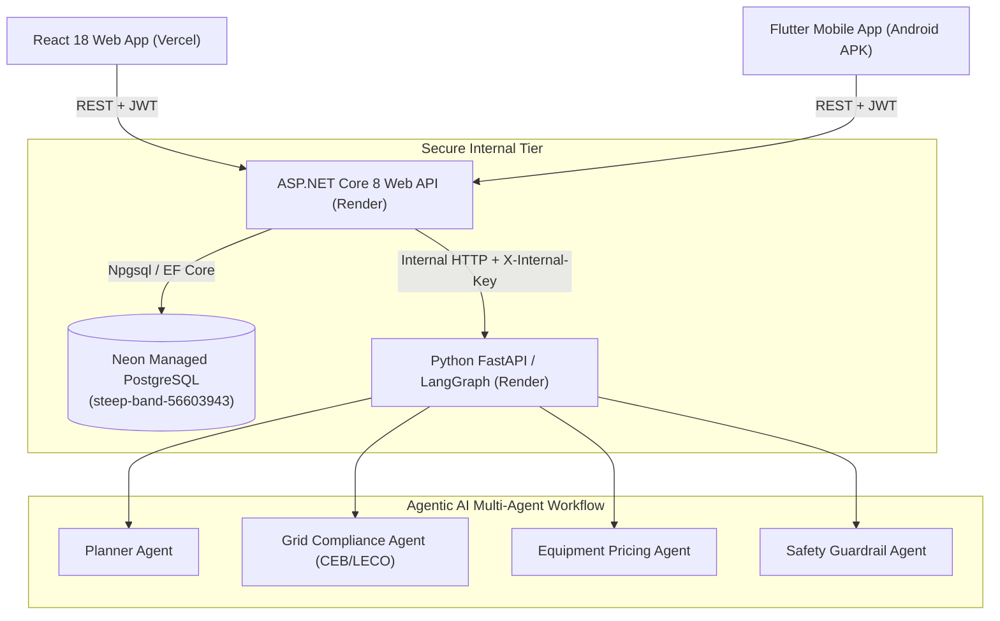

# System Architecture
 
**Smart Solar Installation & Grid Compliance Platform** · SE3090 – Software Engineering Frameworks · Group 2026-AI-17
 
---

## Architectural Overview
 
The Smart Solar Installation & Grid Compliance Platform is structured as a **multi-tier, secure, distributed cloud system** designed for solar installation planning, grid compliance verification, and field telemetry.

```mermaid
graph TD
    ClientWeb["React 18 Web App (Vercel)"] -->|REST + JWT| ApiGateway["ASP.NET Core 8 Web API (Render)"]
    ClientMobile["Flutter Mobile App (Android APK)"] -->|REST + JWT| ApiGateway

    subgraph "Secure Internal Tier"
        ApiGateway -->|Npgsql / EF Core| NeonDB[("Neon Managed PostgreSQL\n(steep-band-56603943)")]
        ApiGateway -->|Internal HTTP + X-Internal-Key| AIService["Python FastAPI / LangGraph (Render)"]
    end

    subgraph "Agentic AI Multi-Agent Workflow"
        AIService --> PlannerAgent["Planner Agent"]
        AIService --> GridAgent["Grid Compliance Agent (CEB/LECO)"]
        AIService --> PricingAgent["Equipment Pricing Agent"]
        AIService --> SafetyAgent["Safety Guardrail Agent"]
    end
```
Three deployable services sit behind this diagram: the ASP.NET Core API (hosted on Render), the FastAPI/LangGraph AI service (also on Render, internal-only), and Neon's managed PostgreSQL. The two client applications — the React web app and the Flutter mobile app are independently deployed (Vercel for web; the mobile app ships as an Android APK) and both speak to the same single gateway.
 
---

## Architectural Boundaries & Principles
### 1. Authoritative Public Entrypoint
 
**ASP.NET Core is the only publicly accessible backend service.**
 
Every request from a client — web or mobile — terminates at the ASP.NET Core API. There is no scenario in which a client holds credentials or a network path to any other backend component. This is what makes the API a true *gateway*, not just one of several entry points: all authentication, authorization, validation, and orchestration logic is centralized in one place, which is also the one place that needs to be hardened, rate-limited, and audited.
 
In practice, this is enforced simply by **what credentials exist where**: only the ASP.NET Core API is configured with the database connection string and the AI service's internal key. Neither client ever receives either secret, so there is nothing for them to connect with even if they tried.
 
### 2. Direct Access Prohibition
 
**Neither React Web nor Flutter Mobile are permitted to communicate directly with Neon PostgreSQL or the Python FastAPI AI service.**
 
This follows from principle 1, but is worth stating as its own rule because it is a common point of architectural drift — it is tempting, for example, to let a mobile client query the database directly for a "quick read," or to call the AI service straight from the browser to save a network hop. Both are explicitly disallowed here:
 
- **Database isolation**: PostgreSQL (Neon) accepts connections only from the API's configured connection string. No client-side code — web or mobile — ever holds a database credential.
- **AI service isolation**: The FastAPI service validates every request against a shared secret header, `X-Internal-Key`, checked via `_require_internal_key()` on each endpoint (`app/main.py`). The ASP.NET Core API attaches this header on every outbound call (`Integrations/AgenticAiService.cs`, `Integrations/EquipmentPricingClient.cs`); no other caller possesses it. A request to the AI service without a valid key is rejected outright, regardless of where it originates.
This boundary keeps the system's two most sensitive dependencies — the data store and the internal reasoning service — unreachable from anything running on a user's device.
 
### 3. Role-Based Access Control
 
**Standard JWT tokens carry user identities and roles** (`HOMEOWNER`, `FIELD_TECHNICIAN`, `SENIOR_ENGINEER`, `INVENTORY_OFFICER`, `ADMINISTRATOR`).
 
Authentication and authorization are layered as follows:
 
- On login, the API issues a signed JWT (HMAC-SHA256) containing the user's identity and role claims, validated on every subsequent request against issuer, audience, lifetime, and signature (`Program.cs`).
- Controllers enforce roles declaratively — for example, `[Authorize(Roles = RoleConstants.Homeowner)]` on survey submission, or combined-role checks like `$"{RoleConstants.SeniorEngineer},{RoleConstants.Administrator}"` on proposal approval — so authorization intent is visible directly on each endpoint rather than buried in business logic.
- Tokens are **session-aware, not just time-limited**: each token embeds a security version (`sv` claim) that is checked against the user's current `SecurityVersion` in the database on every request (`OnTokenValidated` in `Program.cs`). Changing a password increments this version, which immediately invalidates every previously issued token — a stolen or leaked token cannot outlive a password change, even before it naturally expires.
- Authentication endpoints are additionally rate-limited (20 requests/minute per IP, no queueing) to blunt brute-force attempts against login and registration.
Five fixed roles (`Models/RoleConstants.cs`) map directly onto the platform's five real-world actors — homeowner, field technician, senior engineer, inventory officer, and administrator — so every protected endpoint's access rule reads as a statement about *who in the business process* is allowed to act, not an arbitrary permission flag.
 
### 4. Resilience & Graceful Degradation
 
**If downstream AI or database dependencies experience transient downtime, the health and workflow endpoints handle errors safely without platform crashes.**
 
This principle shows up in two concrete places in the codebase:
 
- **`GET /api/health`** (`HealthController.cs`) independently probes both the database (`CanConnectAsync`) and the AI service (`CheckHealthAsync`), catching exceptions from each probe separately. A failure in either dependency sets the overall status to `"degraded"` rather than throwing — the health endpoint itself never crashes, and a single unreachable dependency doesn't mask the state of the other.
- **Compliance evaluation** (`FieldJobService.TriggerComplianceEvaluationAsync`) calls the Grid Compliance Agent but wraps the call in a try/catch: if the AI service is unreachable, the exception is logged as a warning and the system **falls back to a deterministic local evaluator** instead of failing the request outright. A homeowner's or engineer's workflow keeps moving even during a transient AI-service outage.
The shared pattern is: dependencies are expected to fail sometimes, and every caller of a downstream service is written to **report degradation rather than propagate a crash**.
 
---

