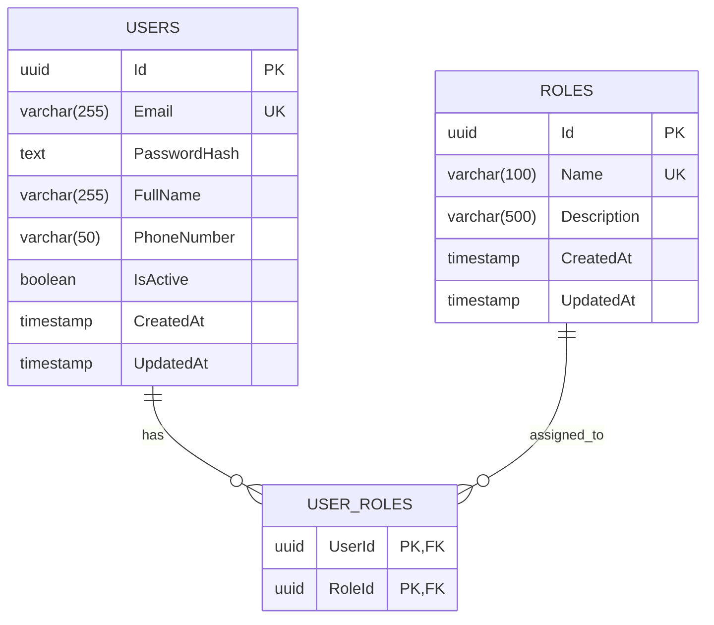

# Database Design & Schema

## Database Provider
- **Provider**: Neon Managed PostgreSQL
- **Project ID**: `steep-band-56603943`
- **Branch**: `production`
- **ORM**: Entity Framework Core 8.0 with `Npgsql.EntityFrameworkCore.PostgreSQL`

## Entity-Relationship Model

## Core Seed Data
The database seeds 5 core system roles:
- `ADMINISTRATOR`
- `SENIOR_ENGINEER`
- `FIELD_TECHNICIAN`
- `HOMEOWNER`
- `INVENTORY_OFFICER`
