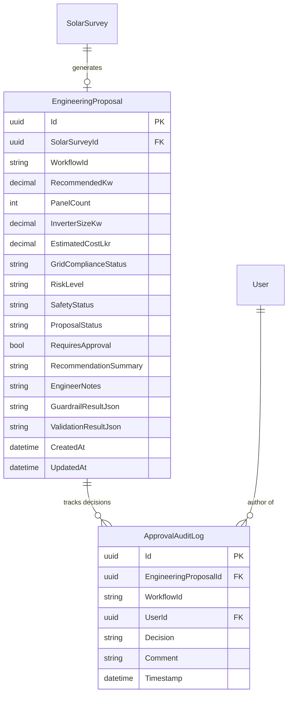

# Engineering Proposal Database Schema Design

## Overview
This document specifies the database design for Phase 4: Engineering Proposal, Safety Guardrails, and Senior Engineer Approval Workflow.

---

## Entity Relationship Diagram



---

## Database Tables

### 1. `EngineeringProposals`

| Column | Type | Nullable | Description |
|---|---|---|---|
| `Id` | `uniqueidentifier` | No | Primary Key |
| `SolarSurveyId` | `uniqueidentifier` | No | Foreign Key to `SolarSurveys(Id)` |
| `WorkflowId` | `nvarchar(64)` | Yes | LangGraph / Guardrail workflow correlation ID |
| `RecommendedKw` | `decimal(18,2)` | No | Recommended solar capacity in kW |
| `PanelCount` | `int` | No | Calculated panel quantity |
| `InverterSizeKw` | `decimal(18,2)` | No | Recommended inverter rating |
| `EstimatedCostLkr` | `decimal(18,2)` | No | Estimated total system cost in LKR |
| `GridComplianceStatus` | `nvarchar(50)` | No | Compliance status from Phase 3 (`COMPLIANT`, `NON_COMPLIANT`, etc.) |
| `RiskLevel` | `nvarchar(50)` | No | Risk level (`LOW`, `MEDIUM`, `HIGH`, `CRITICAL`) |
| `SafetyStatus` | `nvarchar(50)` | No | Guardrail status (`SAFE`, `REQUIRES_APPROVAL`, `BLOCKED`) |
| `ProposalStatus` | `nvarchar(50)` | No | Enum string (`Draft`, `Processing`, `PendingApproval`, `Approved`, `Rejected`, `RevisionRequested`, `Failed`) |
| `RequiresApproval` | `bit` | No | Boolean flag indicating whether human engineer approval is mandatory |
| `RecommendationSummary` | `nvarchar(max)` | Yes | Human-readable AI summary and guardrail finding |
| `EngineerNotes` | `nvarchar(max)` | Yes | Internal engineer commentary |
| `GuardrailResultJson` | `nvarchar(max)` | Yes | Raw JSON output from `SafetyGuardrailAgent` |
| `ValidationResultJson` | `nvarchar(max)` | Yes | Raw JSON output from `DeterministicProposalValidator` |
| `CreatedAt` | `datetime2` | No | Creation timestamp (UTC) |
| `UpdatedAt` | `datetime2` | No | Last update timestamp (UTC) |

---

### 2. `ApprovalAuditLogs`

| Column | Type | Nullable | Description |
|---|---|---|---|
| `Id` | `uniqueidentifier` | No | Primary Key |
| `EngineeringProposalId` | `uniqueidentifier` | No | Foreign Key to `EngineeringProposals(Id)` |
| `WorkflowId` | `nvarchar(64)` | Yes | Correlation ID |
| `UserId` | `uniqueidentifier` | No | Foreign Key to `Users(Id)` (Senior Engineer or Admin) |
| `Decision` | `nvarchar(50)` | No | Decision enum (`Approved`, `Rejected`, `RevisionRequested`) |
| `Comment` | `nvarchar(max)` | Yes | Mandatory commentary for Reject/Revision; optional for Approve |
| `Timestamp` | `datetime2` | No | Audit entry timestamp (UTC) |

---

## State Machine Rules

```
[Draft] -> [Processing] -> [PendingApproval] -> [Approved] (Terminal)
                                             -> [Rejected] (Terminal)
                                             -> [RevisionRequested] -> [Processing]
                         -> [Failed] -> [Processing]
```

---

## Indexes & Constraints

- `IX_EngineeringProposals_SolarSurveyId`: Fast lookup of proposals per survey.
- `IX_EngineeringProposals_ProposalStatus`: Optimized query performance for `/api/proposals/pending`.
- `IX_ApprovalAuditLogs_EngineeringProposalId`: Fast audit timeline loading.
- `FK_EngineeringProposals_SolarSurveys_SolarSurveyId`: Cascades on survey deletion or restricts as configured in EF Core.
